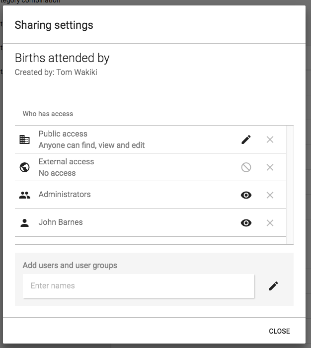

# About Sharing of Objects

This chapter discusses the sharing of entities feature in DHIS2.

## Sharing of Objects

Many objects in DHIS2, like reports, charts, maps, and indicators, can be shared. DHIS2 supports sharing of metadata or sharing of data. 

- **Metadata sharing**: Making an object (e.g., a report) available for reading or modification to a group of users or to everyone.
- **Data sharing**: Making the actual captured data available to others and controlling who can capture it.

For reports, the sharing dialog can be opened by clicking the "Sharing settings" button next to each report. Implementers can restrict access to certain user groups, while users can decide whom to share objects (pivot tables, charts, dashboards, etc.) with.

If sharing is supported for a particular class of objects, a dialog called **"Sharing settings"** will be available. It can usually be accessed by clicking on the object name or through the analytics tools (via the "Share with other people" icon).

### Public and External Access

- **External access**: Allows sharing with everyone, including users who cannot log in to DHIS2. Useful for public resources accessible via a URL.
- **Public access**: Refers to logged-in users. Options under **METADATA**: "No access", "Can view only", "Can edit and view". Options under **DATA**: "No access", "Can view data", "Can capture data".

### Sharing with User Groups

To share with a group:

1. Start typing the group name in the "Search for user groups" input field.
2. Select the desired group.
3. Click the "+" icon to share with that group.
4. Set an access option for each group, similar to public access.

A user group implies all its members get access. To create a group, go to the dashboard module → "Groups" → "Add new".

---

## Metadata Sharing and Access Control

Objects supporting **metadata sharing**:  
`indicator`, `indicator group`, `indicator group set`, `data dictionary`, `data set`, `program`, `standard report`, `resource`, `report table`, `chart`, `map`, `user group`.

- **Open objects**: Report table, chart, map, user group. Can be created privately by any user. Private means only visible to yourself or shared groups.
- **Non-open objects**: Require authority to create. Example: indicator, data set.

### Authority to Create Objects

- **Public objects**: Must have authority to create publicly accessible objects.
- **Private objects**: Applies only to non-open objects. Example: "Create private indicator" allows creating indicators accessible only to yourself.

To allow others to edit non-open objects, the user must have the **update authority**. For example, editing an indicator requires "Update indicator".

When a new object is created:

- If the user has authority for public objects → automatically viewable by everyone.
- Otherwise → viewable only to yourself.

> To view all objects, create a user role with the `ALL` authority and assign it to a user. For switching between complete and personal views, use two separate accounts.

---

## Metadata Sharing Applied

Use-cases:

1. **Global organization with multiple countries**:
    - User groups: global personnel, country personnel.
    - Global data sets/reports → viewable by everyone, editable by global group.
    - Country-specific data sets/reports → viewable/editable by country and global groups only.

2. **Donor/funding agencies scenario**:
    - Create user groups for each entity.
    - Share reports within the organization without affecting others.

3. **Country health department with multiple programs**:
    - User groups per program.
    - Program-specific reports → viewable/editable only by program group.

---

## Data Sharing and Access Control

Objects supporting **data sharing**:  
`data set`, `tracked entity type`, `program`, `program stage`.

Purpose: Control which users can capture or view data.

### Data Sharing for Event-Based Programs

- **Tracked entity type**, **program**, **program stage**.
- **Single event programs** (Event Capture): "DATA: Can view data" required to see program/data.
- **Tracker programs** (Tracker Capture): "DATA: Can view data" required on tracked entity type, program, and program stage to view data. "DATA: Can capture data" required to capture data.

> Note: Users must also report for an organization unit assigned to the program.

#### Tracker Programs Data Sharing

| Object type | Can view data | Can capture data | Comment |
|-------------|---------------|-----------------|---------|
| **Tracked entity type** | Search tracked entities; see attributes | Edit attributes, register, delete, deactivate/reactivate instances | |
| **Program** | Search tracked entities; see program attributes, enrollment, notes | Enroll, edit, complete/reopen enrollments; add notes; edit relationships; delete enrollments | Requires "Can view data" for tracked entity type |
| **Program stage** | See stage, events, notes | Add/schedule/refer events; edit values; add notes; delete events | Requires "Can view data" for program and tracked entity type |

#### Single Event Programs Data Sharing

| Object type | Can view data | Can capture data | Comment |
|-------------|---------------|-----------------|---------|
| **Program** | See list of events; see tracked entity data values | Add, edit, delete events | |

### Data Sharing for Data Sets

- **Data set** and **category option**.
- To save data in Data Entry app, user needs:
  1. Authority: `F_DATAVALUE_ADD`
  2. Data set shared with "DATA: Can capture data"
  3. Data element shared with "METADATA: Can view"
  4. All category options shared with "DATA: Can capture data"

> Note: Users must report for an organization unit assigned to the data set.

#### Data Sets Sharing Table

| Object type | Can view data | Can capture data | Comment |
|-------------|---------------|-----------------|---------|
| **Data set** | View data in Analytics | See in Data Entry app; save data via API | Requires "Can capture data" for Category Options |
| **CategoryOption** | View data values in Analytics | Save data values in Data Entry app | All CategoryOptions in combos must have "Can capture data" |
