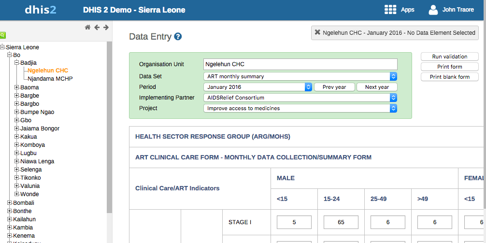

# Additional Data Dimensions

## About Additional Data Dimensions

DHIS2 allows adding dimensions to data in addition to the standard dimensions. These additional dimensions are called **attribute categories (ACs)**. The standard categories described in the previous chapter are referred to as **disaggregation categories (DCs)** to differentiate them from ACs.

ACs and DCs are similar—they work in the same way, are accessed through the same part of the maintenance interface, and exist in the same part of the database. The main difference is:

- **DC**: Attached to a data element. Values for all DC options can be entered on the same data entry screen.
- **AC**: Attached to a data set. You must choose the AC option before entering data.

While you could use only DCs, ACs help simplify data entry screens or reduce the size of the cross-product of category option combos.

> **Tip**  
> When deciding which categories should be DCs or ACs:  
> - Use **DCs** for different combinations of categories on different data elements within a data set.  
> - Use **DCs** to enter all category option combinations on one screen.  
> - Use **ACs** for the same combination of categories across all data in a data set.  
> - Use **ACs** to enter only one category option combination on a single screen.

DCs and ACs can answer questions about a data element beyond just *what*, including *who*, *why*, *how*, *where*, or *when*.

---

## Create or Edit an Attribute Category and Its Options

Creating an attribute category, its options, and combinations is described in [Manage Categories](manage_category.html).  

- **DCs** are configured by editing a data element.  
- **ACs** are configured by editing a data set.

---

## Data Entry with Disaggregation Categories and Attribute Categories

When entering aggregate data:

1. Select the **attribute categories**.
2. Enter data across **disaggregation categories** on a single page.

Example:  

- **Attribute categories**: Implementing Partner (AIDSRelief Consortium), Project (Improve access to medicines)  
- **Disaggregation categories**: Gender (male/female/etc.), Age ( less than 15, 15-24, 25-49,  greater than 49)

---

## Analysis with Disaggregation Categories and Attribute Categories

To include these categories in analysis:

- Check the **Data dimension** box in the category editing screen of the Maintenance app.  
- See [Create or Edit a Category](manage_category.html#create_category) for details.

---

## Approvals with Attribute Categories

To include ACs in approvals:

1. Create a **category option group** containing the same options as the AC.  
2. Create a **category option group set**.  
3. Add the group set as a **data approval level**.

For details, see:  

- [Approving by Category Option Group Set](data_approvals_approving_by_cogs.html)  
- [Approving by Multiple Category Option Group Sets](approving_by_multiple_category_option_group_sets.html)

---

## Attribute Categories and the Datavalue Table

Each data value in DHIS2 is associated with:

- `dataelementid`
- `periodid`
- `sourceid`

Each data value also has a **value** column:

| dataelementid | periodid | sourceid | value |  |  |
|---------------|----------|----------|-------|--|--|

Each data value references:

- **Disaggregation category option combination** via `categoryoptioncomboid`.  
- **Attribute category option combination** via `attributeoptioncomboid`.

Example:  

- Data value for "\<15" →  
  - Gender (DC) = "Male"  
  - Age (DC) = " \>15"  
  - `categoryoptioncomboid` = "Male, \<15"  

- Attribute categories →  
  - Implementing Partner = "AIDSRelief Consortium"  
  - Project = "Improve access to medicines"  
  - `attributeoptioncomboid` = "AIDSRelief Consortium, Improve access to medicines"

| dataelementid | periodid | sourceid | value | categoryoptioncomboid | attributeoptioncomboid |
|---------------|----------|----------|-------|---------------------|----------------------|

> **Note**  
> Not all columns in the datavalue table are shown.

If no disaggregation category combination is defined for a data element, `categoryoptioncomboid` references a **default category option combination**. Similarly, if no attribute category combination is defined, `attributeoptioncomboid` references the default.

This illustrates how data values are linked to both disaggregation and attribute category options in DHIS2.
