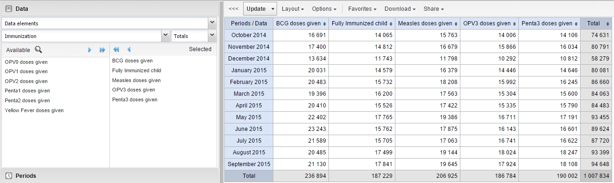
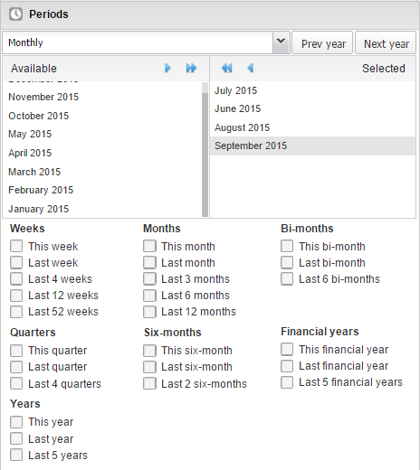
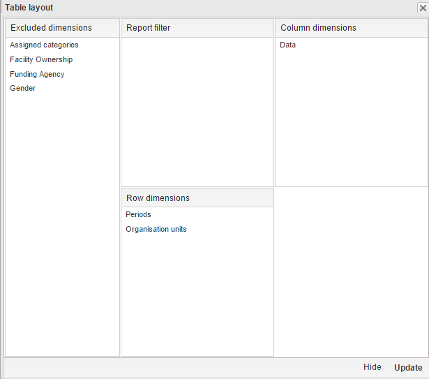
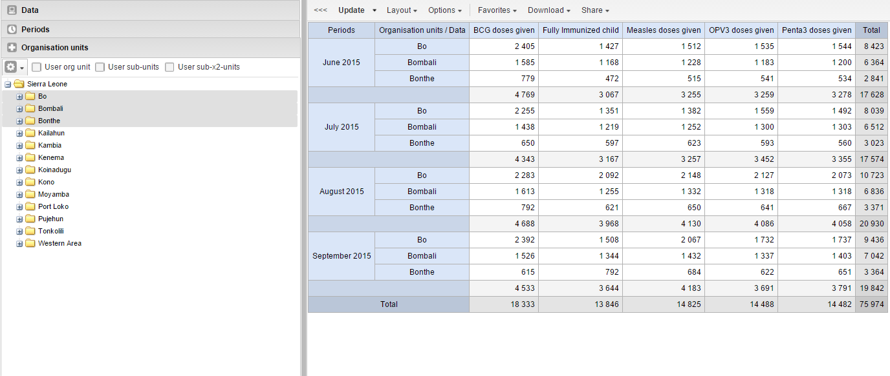

# Analyze data in pivot tables

## About the Pivot Table app
With the **Pivot Table** app, you can create pivot tables based on all available data dimensions in DHIS2. A pivot table is a dynamic tool for data analysis which lets you summarize and arrange data according to its dimensions. Examples of data dimensions in DHIS2 are:

- Data dimension itself (data elements, indicators, events)
- Periods (time period for the data)
- Organisation hierarchy (geographical location of the data)

From these dimensions, you can freely select *dimension items* to include in the pivot table. You can create additional dimensions using group sets (e.g., Partner, Facility Type).

A pivot table can arrange data dimensions on **columns**, **rows**, or **filters**.

> **Tip**
> - You must select at least one dimension on columns or rows.  
> - You must include at least one period.  
> - Data element group sets and reporting rates can't appear in the same table.  
> - Pivot tables can't exceed the analytic record limit defined in system settings.  
> - You can drill up/down on period and organisation unit.

## Create a pivot table
1. Open the **Pivot Table** app.
2. Select dimension items from the left menu.
3. Click **Layout** and arrange columns, rows, and filters.
4. Click **Update**.

## Select dimension items
You can select any number of dimension items under each dimension section.  
You must select at least one item before using a dimension.

### Data dimension types
| Data dimension type | Definition | Examples |
|---|---|---|
| **Indicators** | A calculated formula based on data elements. | Immunization coverage. |
| **Data elements** | Represents the phenomenon for which data has been captured. | Malaria cases; BCG doses. |
| **Data sets** | A collection of data elements for data collection. Includes reporting rates, actual reports, expected reports, etc. | Reporting rates. |
| **Event data items** | Data element part of a program event. | Average weight/height. |
| **Program indicators** | Calculated formula for program events. | Average BMI. |

### Periods
- **Fixed periods** (e.g., January 2012)
- **Relative periods** (e.g., Last month, Last 12 months, Last 5 years)

Relative periods automatically update when the favorite is viewed later.

### Organisation units
- Select manually or using **Select all children**
- Use **User org unit**, **User sub-units**, **User sub-x2-units**
- Supports dynamic group sets (e.g., Partner, Facility Type)

## Modify pivot table layout

Click **Layout** and drag dimensions to:

- **Columns**
- **Rows**
- **Filters**

## Change the display of your pivot table
1. Open **Pivot Table** app.
2. Create or open a favorite.
3. Click **Options**.
4. Set options as required.
5. Click **Update**.

### Pivot table options
(Options table omitted for brevity in this demonstration)

## Manage favorites
- Open, Save, Rename, Share, Interpret, Subscribe

## Download data from a pivot table
- Table layout formats (Excel, CSV, HTML)
- Plain data formats (JSON, XML, CSV, Excel)
- JRXML, Raw SQL export

## Embed a pivot table in a web page
Use **Embed** to copy HTML.

## Visualize pivot table as chart or map
- Open table as chart
- Open selection as chart
- Open table as map
- Open selection as map
