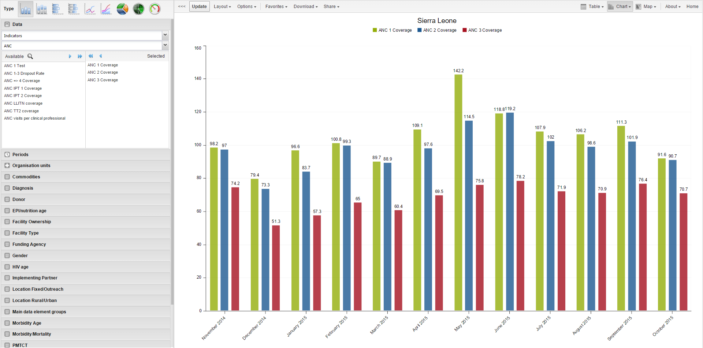
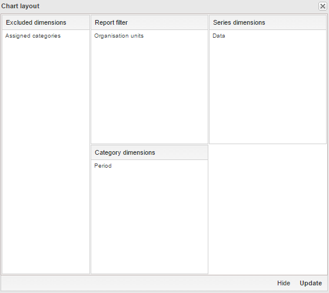

# Data Visualizer

This chapter refers to the **legacy** version of the Data Visualizer.  
For the current version, see the **[new Data Visualizer](./data_visualizer.md)**.

## About the Data Visualizer App

The **Classic Data Visualizer** app lets you select indicators, data elements, periods, and organisation units for analysis.  
It works well on poor connections and generates charts in the web browser.

> **Tips**
>
> - Click series labels in the chart to hide/show them.  
> - Use the triple-left-arrow on the top center to collapse the side menu.

---

## Create a Chart

1. Open the **Classic Data Visualizer** app and choose a chart type.
2. Select metadata from all three dimensions:  
   - **Data** (indicators, data elements, reporting rates)  
   - **Periods** (fixed or relative)  
   - **Organisation units**
3. Click **Layout** to arrange dimensions.
4. Click **Update** to generate the chart.

> **Note:**  
> Default period type can be changed in:  
> **System Settings → General → Default relative period for analysis**.

---

## Select a Chart Type

There are **nine** chart types:

| Chart Type | Description |
|-----------|-------------|
| **Column chart** | Vertical bars for comparison across units. |
| **Stacked column** | Vertical stacked bars to show sums and trends. |
| **Bar chart** | Same as column, but horizontal. |
| **Stacked bar** | Horizontal stacked bars. |
| **Line chart** | Time-series visualization. |
| **Area chart** | Filled line chart for comparing trends. |
| **Pie chart** | Proportional circular chart. |
| **Radar chart** | Spider chart showing multivariate data. |
| **Speedometer chart** | Gauge chart (0–100%). |

Select the type under **Chart type** → click **Update**.

---

## Select Dimension Items {#data_vis_select_dim_items}

DHIS2 data uses three main dimensions:

- **Data:** indicators, data elements, datasets  
- **Periods:** fixed or relative  
- **Organisation units:** where the event occurred  

You can select items by:

- Double-click  
- Single-arrow / double-arrow buttons  
- Clearing items from the **Selected** list  

### Select Indicators
1. Click **Data → Indicators**.  
2. Choose an indicator group.  
3. Double-click indicators to move them to **Selected**.

### Select Data Elements
Same steps as indicators.

### Select Reporting Rates
1. Click **Data → Reporting rates**.  
2. Double-click rates to add.

### Select Fixed & Relative Periods
You may combine both.

- **Fixed periods:** select a period type, pick periods.  
- **Relative periods:** e.g., Last month, Last 12 months.

### Select Organisation Units

1. Click **Organisation units**.  
2. Select **Selection mode**:

| Mode | Description |
|------|-------------|
| **Select organisation units** | Choose units from the tree or use user-based shortcuts. |
| **Select levels** | Select all units at a certain hierarchy level. |
| **Select groups** | Select units by group (e.g., hospitals). |

3. Click **Update**.

### Additional Dimensions
Depending on configurations (e.g., age, sex), you may add extra dimensions for analysis.

---

## Series, Category, and Filter {#data_vis_series_category_filter}

Use **Layout** to assign:

- **Series** → trends (e.g., periods)  
- **Categories** → comparison groups (e.g., org units)  
- **Filter** → restrict data (only 1 item allowed for Data dimension)

Drag and drop, then click **Update**.

---

## Change Chart Display {#datavis_change_display}

Use **Options** to customize chart appearance.

| Option Group | Setting | Description |
|--------------|---------|-------------|
| **Data** | Show values | Display numeric values on chart. |
| | 100% stacked | Normalize columns to 100%. |
| | Cumulative | Cumulative line values. |
| | Hide empty categories | Remove missing-value items. |
| | Trend line | Show performance trend. |
| | Target/Base line | Add reference lines. |
| | Sort order | Sort values ascending/descending. |
| | Aggregation type | Count, Min, Max, etc. |
| **Events** | Include only completed events | Exclude partial events. |
| **Axes** | Min/Max, ticks, decimals, titles | Customize axis appearance. |
| **Style** | No space between bars | Useful for EPI curves. |
| **General** | Hide title, subtitle, legend | Clean up visual appearance. |

---

## Manage Favorites

Favorites allow saving, sharing, and reusing charts.

### Open a Favorite
Go to **Favorites → Open** and pick one.

### Save a Favorite
**Favorites → Save as** → enter *Name* and *Description*.

### Rename
**Favorites → Rename**

### Interpretations
Write an interpretation for shared favorites:

- Supports **bold**, *italic*, emojis, mentions (@username), and URLs.

### Subscribe
Receive notifications on updates.

### Get Link
Generate links for:
- Use in the app  
- Web API (JSON, CSV, etc.)

### Delete
**Favorites → Delete**

### View Interpretations for Relative Periods
Click interpretation items to load chart with the correct date context.

---

## Download a Chart {#data_vis_save_chart}

**Download → Graphics → PNG or PDF**

---

## Download Chart Data Source {#data_vis_download_chart_data}

Download data behind the chart in various formats:

| Format | Description |
|--------|-------------|
| **JSON** | ID-based; also Code/Name supported |
| **XML** | ID-based; also Code/Name supported |
| **Excel** | ID/Code/Name |
| **CSV** | ID/Code/Name |
| **JRXML** | Jasper Report template |
| **Raw SQL** | SQL used to generate the visualization |

---

## Embed Charts in Any Web Page {#data_vis_embedding}

**Share → Embed in web page**  
Copy the generated HTML snippet.

---

## Open as Pivot Table or Map

In the chart view, click **Chart** or **Map** to switch.

---

