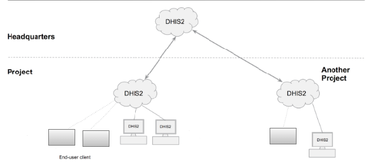
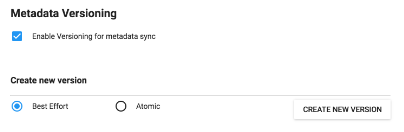
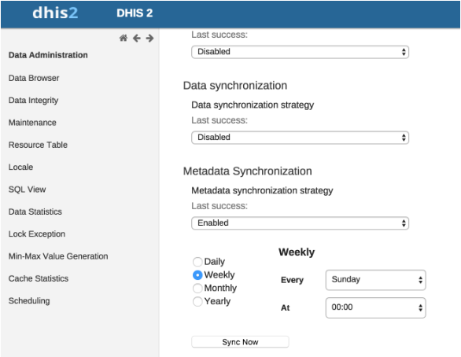
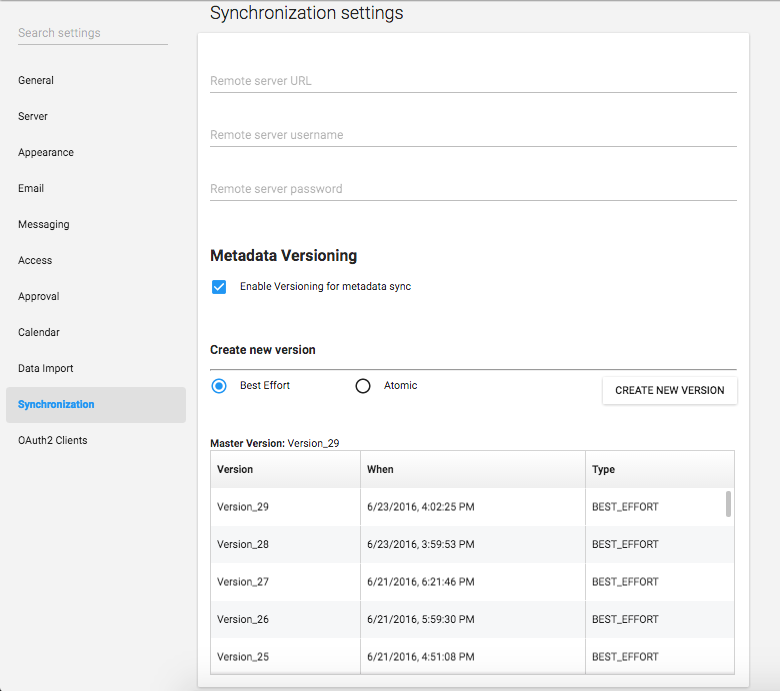
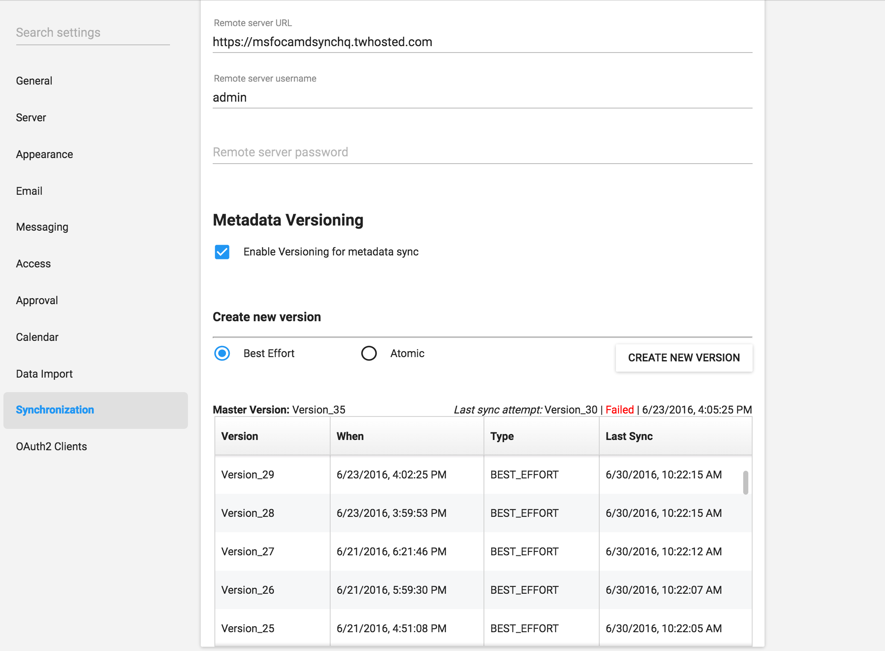

# Configure metadata synchronizing

## About data and metadata synchronization

You can synchronize data and metadata between different DHIS2 instances.  
Given two instances in a central-local deployment strategy, metadata created at the central system can be synchronized with the local system and the data created at the local system can be synchronized with the central system. This can be useful when you've multiple stand-alone instances of DHIS2 and global metadata needs to be created at all the local instances.

If metadata creation and update take place at the central system and if the metadata synchronisation task is enabled, the metadata gets synchronized down to all the local instances which are bound to the central instance. These local instances will in turn push data values and complete data registration sets to the central instance.

Enabling or disabling versioning of metadata synchronization at local instance will not hinder the metadata synchronization process. This is because the metadata synchronization interacts with versioning endpoints of the central instance and not with endpoints of the local instance.

Each snapshot of metadata export generated is referred to as a metadata version. A new metadata version contains only the changes between the previous version and the current version — it is an export between two timestamps. All metadata versions are maintained in the DHIS2 database and are available to all local instances that connect to it. You can schedule each of the local instances to download new metadata versions. It is recommended to keep the metadata versions' sizes small and logical.

> **Warning**  
> Each instance of DHIS2, whether central or local, can create metadata versions.  
> The local instance is meant to synchronize metadata from a central system and not create metadata on its own.  
>
> If a new metadata version is created on the local instance, this instance can't receive new metadata versions from the central instance, since the content of the metadata versions will be out of synchronization.  
>
> If you've created metadata versions on a local instance, you must manually delete these versions from the database before you can synchronize with the central instance.  
>
> Assume the central and local DHIS2 instances have identical metadata snapshots until version 10. Then the local instance creates a new snapshot called version 11. After that, the central instance creates a new snapshot called version 11. When the local instance attempts to synchronize metadata, version 11 is not downloaded. However, the content of version 11 on the local instance is not identical to the content of version 11 on the central instance.

> **Note**  
> You can also use the **Import-Export** app to synchronize metadata manually.

---

## Workflow

1. On the central instance, configure metadata versioning.  
2. Connect local instance(s) to the central instance.  
3. On local instance(s), configure automatic synchronization.

---

## Configure metadata versioning on central instance

> **Note**  
> To synchronize metadata, the user account of the central system must have the following authority: **F_METADATA_MANAGE**

1. On the central instance, open the **System Settings** app → **Synchronization**.
2. Go to **Metadata versioning** → select **Enable versioning for metadata sync**.

   

3. (Optional) Select **Don't sync metadata if DHIS2 versions differ**.
4. Select version type: **Best effort** or **Atomic**.
5. Click **Create new version**.

---

## Connect local instance to central instance

1. On the local instance, open **System Settings** → **Synchronization**.
2. Add the central instance details:
   - Remote server URL  
   - Remote server username  
   - Remote server password
3. Under **Metadata versioning**, enable versioning.
4. (Optional) Enable **Don't sync metadata if DHIS2 versions differ**.
5. (Optional) Configure email notifications.

---

## Configure automatic metadata synchronization (local instance)

1. Open **Data Administration** → **Scheduling**.
2. Under **Metadata Synchronization**, enable it.
3. Select schedule: **Daily**, **Weekly**, **Monthly**, **Yearly**.

   

4. Click **Start**.

---

## Create a new metadata version manually

1. Open **System Settings** → **Synchronization**.
2. Enable metadata versioning.
3. Select optional version-difference restriction.
4. Select **Best effort** or **Atomic**.
5. Click **Create new version**.

---

### Version table (central instance)

| Object | Description |
|--------|-------------|
| Master version | The latest version in the system. |
| Version | Name of the version. |
| When | Timestamp of creation. |
| Type | Metadata version type. |

---

### Version table (local instance)

| Object | Description |
|--------|-------------|
| Master version | Latest version on central instance |
| Last sync attempt | Shows failure message if sync failed |
| Version | Version name |
| When | Timestamp from central instance |
| Type | Version type |
| Last sync | Timestamp of last successful sync |

---

## Reference information: metadata sync configuration parameters

The Metadata Sync Task performs:

- Pushes aggregate & anonymous event data to central instance
- Retrieves current local metadata version
- Fetches newer versions from central instance
- Synchronizes versions sequentially
- Sends email notifications (if configured)

### Config parameters in `dhis.conf`

| Parameter | Default value |
|----------|----------------|
| `metadata.sync.retry` | 3 |
| `metadata.sync.retry.time.frequency.millisec` | 30000 |

Example:

`metadata.sync.retry` = 5

`metadata.sync.retry.time.frequency.millisec` = 10000
