# Using the GIS app

## About the GIS app

With the GIS app you can overlay multiple layers and choose among different base maps. You can create thematic maps of areas and points, view facilities based on classifications, and visualize catchment areas for each facility. You can add labels to areas and points, and search and filter using various criteria. You can move points and set locations on the fly. Maps can be saved as favorites and shared with other people.

> **Note**
>
> To use predefined legends in the **GIS** app, you need to create them first in the **Maintenance** app.

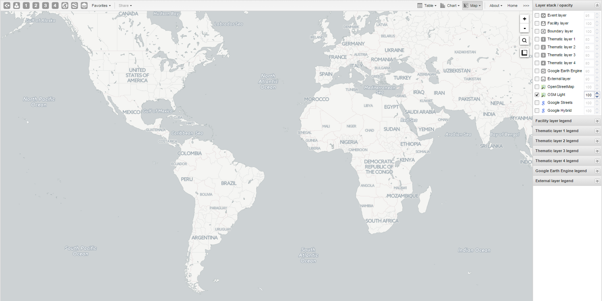

- The icons in the top left of the workspace represent the map layers. They are the starting point of the **GIS** app.
- The panel on the right side of the workspace shows an overview of the layers:
  - The default base map is OSM Light. If online, you can also use OpenStreetMap, Google Streets, or Google Hybrid.
  - Adjust layer opacity with the up and down arrows.
  - Use map legends when creating a thematic map to explain values and colors.
- **Zoom to content** automatically adjusts zoom and center to focus on your data.
- Click an event to view its information.
- Right-click to display the longitude and latitude of the map.

## Create a new thematic map

Use four vector layers to create a thematic map:

1. In the **Apps** menu, click **GIS**.
2. Click a layer in the top menu: Event layer, Facility layer, Boundary layer, or Thematic layer 1–4.
3. Click **Edit layer** and select the parameters.
4. Click **Update**.

## Manage event layers

The event layer shows the geographical location of events registered in DHIS2. Aggregated events can be displayed at facility or boundary level.

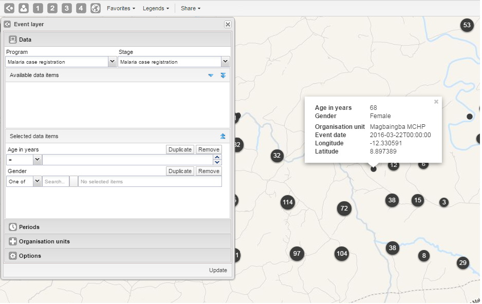

### Create or modify event layer

1. Click the event layer icon > **Edit layer**.
2. Select a program and program stage.
3. Select data elements or attributes from **Available data items**.
4. Configure selection for text, option sets, or other types.
5. Set **Periods** (fixed or relative).
6. Select **Organisation units**.
7. Options:
   - Choose coordinate field.
   - Enable/disable clustering and set style (color, radius).
8. Click **Update**.

### Turn off cluster

1. Click event layer icon > **Edit layer** > **Options**.
2. Clear **Group nearby events**.
3. Click **Update**.

### Modify cluster style

1. Click event layer icon > **Edit layer**.
2. Change **Point color** and **Point radius** under **Options**.
3. Click **Update**.

### Modify event pop-up window information

1. Open **Programs / Attributes** app.
2. Click program > **View program stages**.
3. Select stage > **Edit**.
4. Select **Display in reports** for each data element.
5. Click **Update**.

### Clear event layer

1. Click event layer icon > **Clear**.

## Manage facility layers {#using_gis_facility_layer}

The facility layer shows icons representing types of facilities. Polygons do not appear.

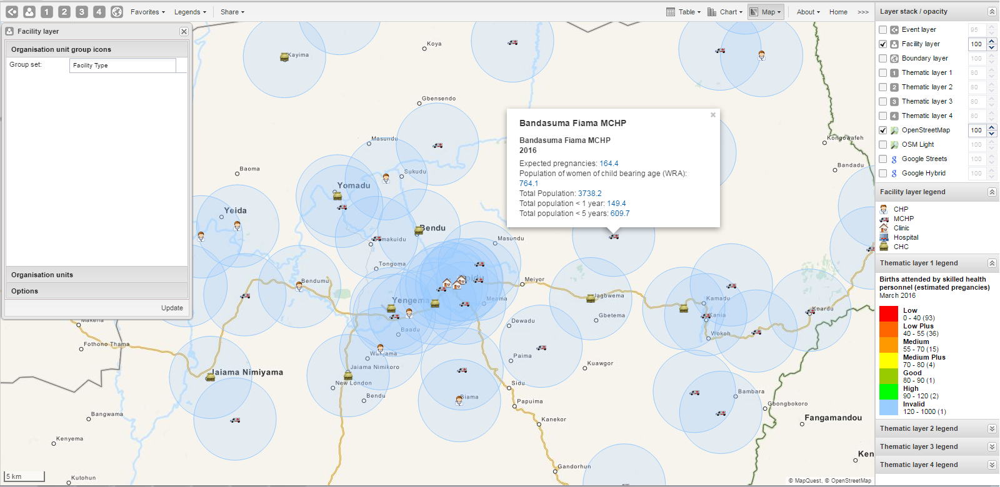

### Create or modify a facility layer

1. Click facility layer icon > **Edit layer**.
2. Select **Organisation unit group icons** and **Organisation units**.
3. Configure **Options** for labels and circles.
4. Click **Update**.

### Search for an organisation unit

1. Click facility layer icon > **Search**.
2. Enter name or select from the list. The unit is highlighted on the map.

### Clear facility layer

1. Click facility layer icon > **Clear**.

### Manage facilities in a layer

- **Relocate**: Right-click > **Relocate** > place cursor at new location.
- **Swap long/lat**: Right-click > **Swap long/lat**.
- **Display information**: Click facility for current period; right-click > **Show information** for specific period.

## Manage thematic layers 1–4 {#using_gis_thematic_layer}

These layers let you create thematic maps using your data. Aggregated data and coordinates must be available.

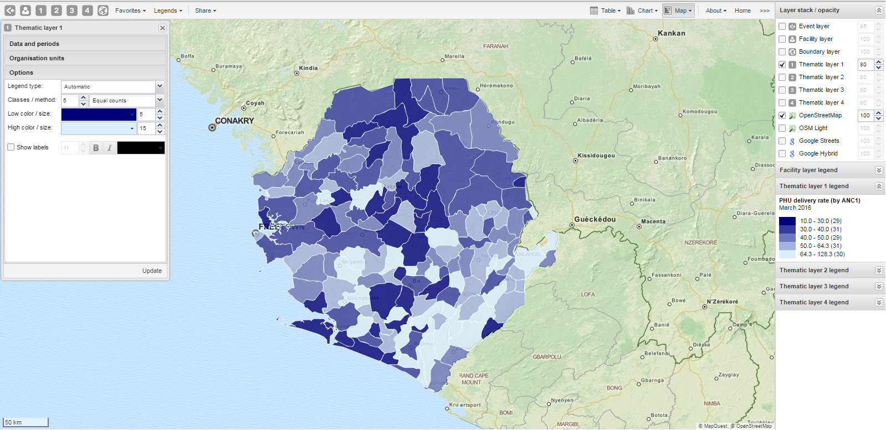

### Create or modify a thematic layer

1. Click the thematic layer icon > **Edit layer**.
2. Select **Data and periods**.
3. Select **Organisation units**.
4. Configure **Options**:
   - Choose **Legend type** (Automatic or Predefined).
   - Set label display and radius for facilities.
   - Select aggregation type ([Aggregation operators](https://dhis2.github.io/dhis2-docs/master/en/user/html/ch10s05.html#d0e8082)).
5. Click **Update**.

### Filter values

1. Click thematic layer icon > **Filter...**
2. Set **Greater than** / **Lower than** values.
3. Click **Update**.

### Search for organisation units

1. Click thematic layer icon > **Search**.
2. Enter name or select from list.

### Navigate organisation hierarchies

1. Right-click a visible unit > **Drill up** or **Drill down**.

### Clear thematic layer

1. Click thematic layer icon > **Clear**.

## Manage boundary layers

The boundary layer displays borders and locations of organisation units.

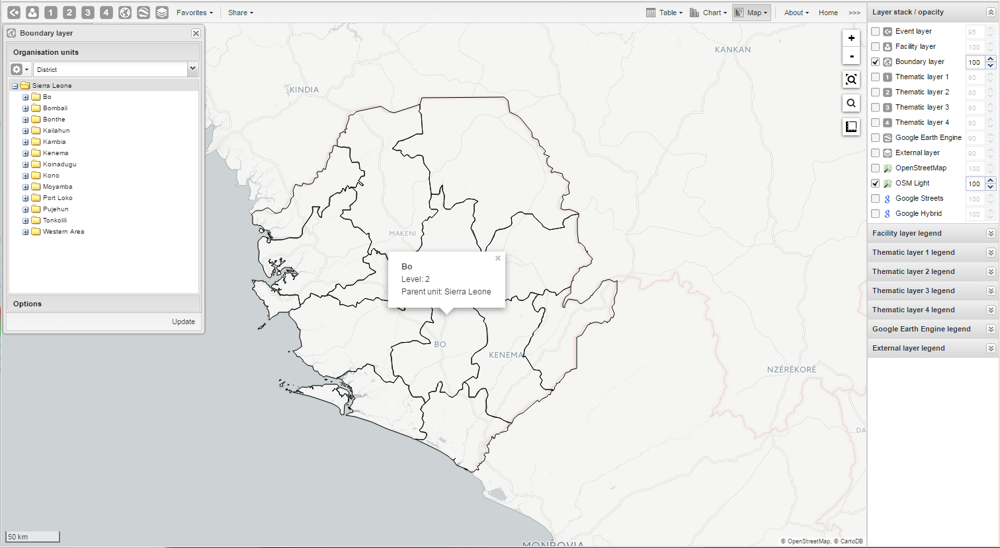

### Create or modify boundary layers

1. Click boundary layer icon > **Edit layer**.
2. Select **Organisation units** (level and parent).
3. Configure **Options** for labels.
4. Click **Update**.

### Search and navigate

- **Search**: Click boundary layer icon > **Search**.
- **Navigate**: Right-click > **Drill up** or **Drill down**.

### Clear boundary layer

1. Click boundary layer icon > **Clear**.

## Manage Earth Engine layer {#using_gis_gee}

The Google Earth Engine layer displays satellite imagery and geospatial datasets.

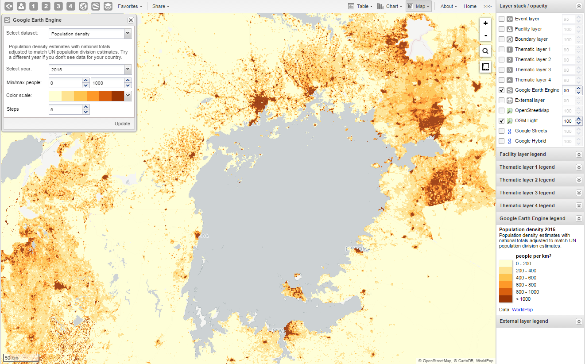

### Create or modify Earth Engine layer

1. Click **Google Earth Engine** layer icon.
2. Select dataset (e.g., Elevation).
3. Set **Min / max value**, **Color scale**, and **Steps**.
4. Click **Update**.

## Add external map layers {#using_gis_external_map_layers}

1. Click **External layer** icon > **Edit**.
2. Select layer > **Update**.
3. To remove, click **Clear**. To hide, clear checkbox in **Layer stack/opacity**.

Examples of external layers:

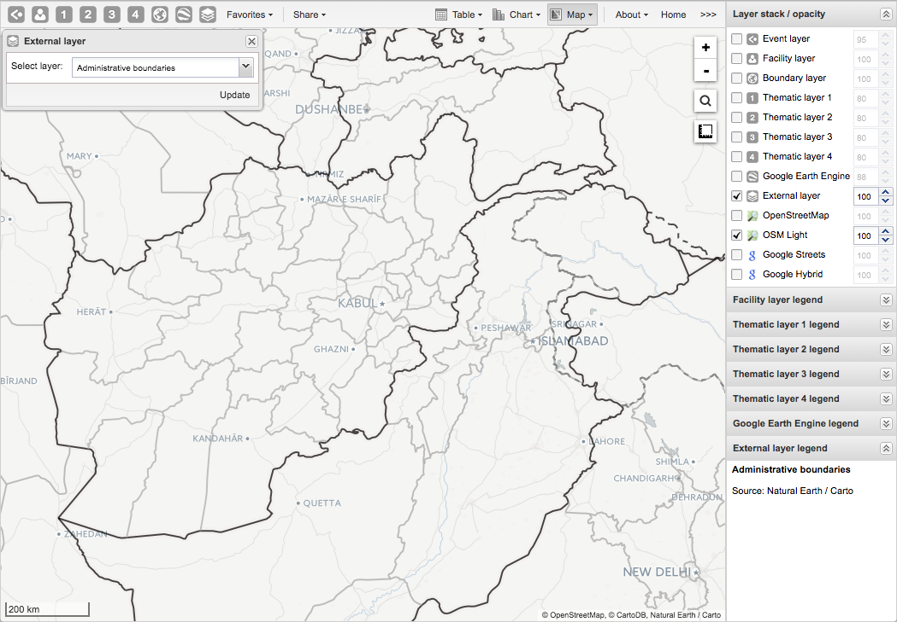
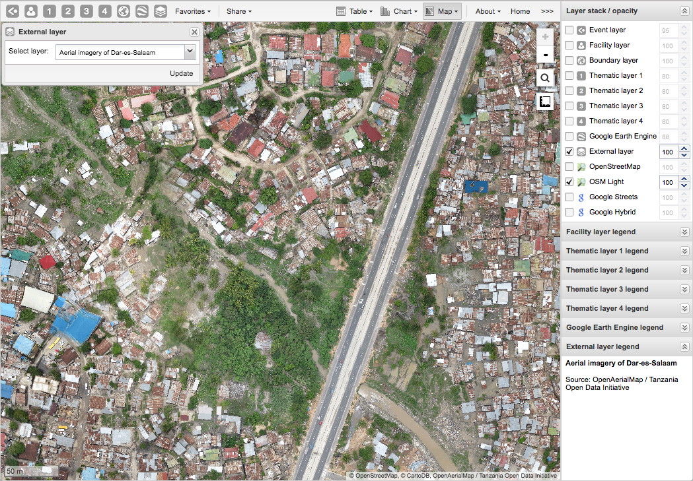
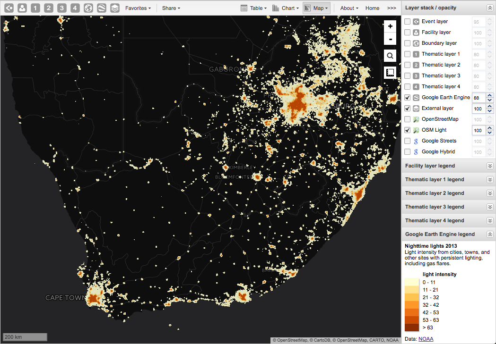
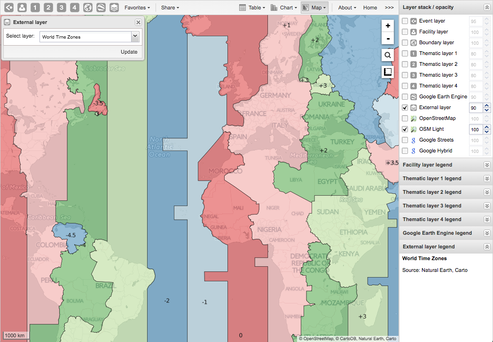

> **Note**: See [Maintenance app documentation](https://dhis2.github.io/dhis2-docs/master/en/user/html/manage_ext_maplayer.html).

## Manage map favorites {#using_gis_favorites}

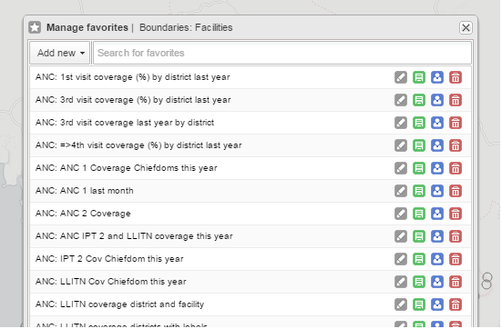

### Save a map as a favorite

1. Click **Favorites** > **Add new**.
2. Enter name > **Create**.

### Open a favorite

1. Click **Favorites**.
2. Search or browse > click name.

### Rename, overwrite, or delete favorites

- **Rename**: Grey rename icon > type new name > **Update**.
- **Overwrite**: Green overwrite icon > **OK**.
- **Delete**: Red delete icon > **OK**.

### Share a map interpretation {#gisInterpretation}

1. Open favorite > **Share** > **Write interpretation**.
2. Enter text > **Share**.

### Modify sharing settings

1. Click **Favorites** > blue share icon.
2. Add user groups, set access, select external access if needed.
3. Click **Save**.

## Save a map as an image {#using_gis_image_export}

1. Take a screenshot.
2. Save in desired format.

## Embed a map in an external web page {#using_gis_embed}

1. Click **Share** > **Embed in web page**.
2. Copy HTML fragment.

## Search for a location {#using_gis_search}

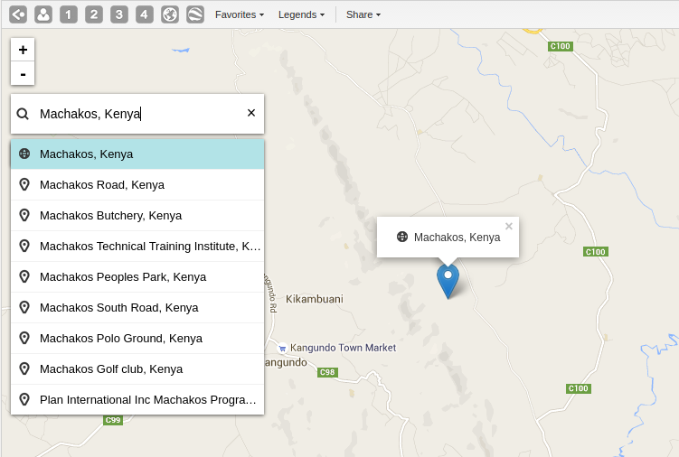

1. Click magnifier icon.
2. Type location > select from list. A pin appears on the map.

## Measure distances and areas {#using_gis_measure_distance}

1. Click **Measure distances and areas** icon > **Create new measurement**.
2. Add points.
3. Click **Finish measurement**.

## Get latitude and longitude {#using_gis_latitude_longitude}

Right-click map > **Show longitude/latitude**.

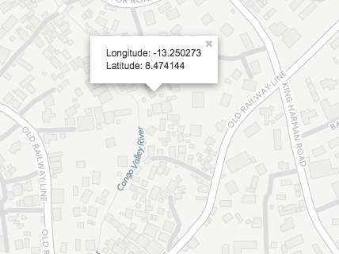

## View a map as pivot table or chart {#using_gis_integration}

- **Chart**: Click **Chart** > **Open this map as chart**.
- **Pivot table**: Click **Chart** > **Open this map as table**.

## See also

- [Manage legends](https://docs.dhis2.org/master/en/user/html/manage_legend.html)
