# Using the Tracker Capture app

## About the Tracker Capture app

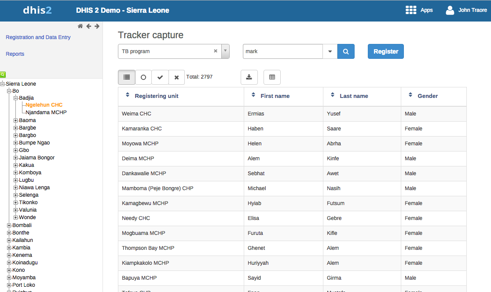

The **Tracker Capture** app is an advanced version of the **Event Capture** app.

- **Event Capture**: handles single events *without* registration
- **Tracker Capture**: handles multiple events (including single event) *with* registration.
- You capture event data for a registered tracked entity instance (TEI).
- You only see programs associated with the organisation unit you've selected and programs you've access to view through your user role.
- The options you see in the search and register functions depend on the program you've selected. The program attributes control these options. The attributes also decide the columns names in the TEI list.  
  If you don't select a program, the system picks default attributes.
- Both skip-logic and validation error/warning messages are supported during registration.
- When you close an organisation unit, you can't register or edit events to this organisation unit in the **Tracker Capture** app. You can still search for TEIs and filter the search results. You can also view the dashboard of a particular TEI.

## About tracked entity instance (TEI) dashboards

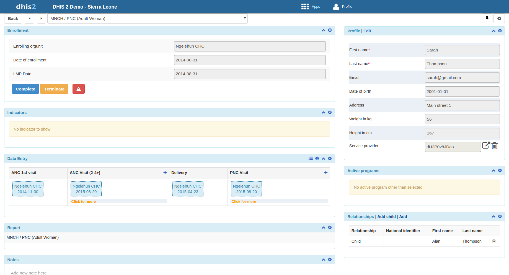

You manage a TEI from the TEI's dashboard in the **Tracker Capture** app.

- The dashboard consists of widgets. Drag and drop the widgets to place them in the order and position you want.
- Click the pin icon to stick the right column of widgets to a fixed position. This is useful especially during data entry.  
  If you have many data elements or a big form to fill in, stick the right widget column. Then all the widgets you've placed in the right column remain visible while you scroll in the data entry part.
- Any indicator defined for the program you've selected will have its value calculated and displayed in the **Indicators** widget.

Navigation:

- **Back**: takes you back to the search and registration page
- Previous and next buttons: takes you to the previous or next TEI dashboard in the TEI search results list
- **Other programs** field: if the TEI is enrolled in other programs, they're listed here. Click a program to change the program for which you enter data for the selected TEI. When you change programs, the content in the widgets change too.

## Workflow

Working process of Mother and child health program:

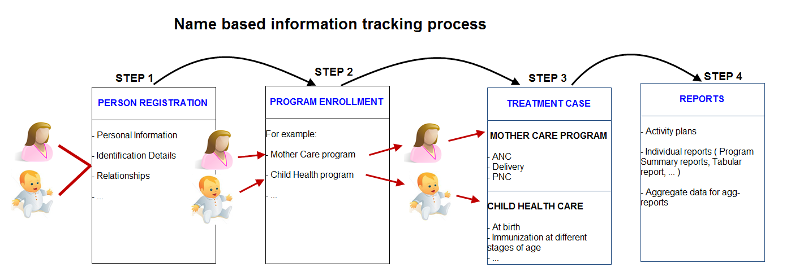

1. Create new or find existing TEI. You can search on defined attributes, for example name or address.
2. Enroll TEI in a program.
3. Based on the services of the program by the time, the app creates an activity plan for the TEI.
4. The TEI is provided with various services depending on the program. All services are recorded.
5. Use information about the individual cases to create reports.

## Linking to the Tracker Capture App

### Link to a specific program on the "home screen"

You can share a program selection on the "home screen":

1. Open the **Tracker Capture** app.
2. Select the program you want to link to.
3. Copy the URL. Make sure that the URL contains the "program" parameter.
4. Paste the URL in the sharing method of your choice, for example an e-mail or a message within DHIS2.

> Note: If the program does not exist in the selected organisation unit (stored in the local cache), the system will select the first available program for that organisation unit. If the local cache is empty/clean and the root organisation unit of the current user does not have the specified program, the system will select the first available program for the root organisation unit.

### Linking to TEI dashboard

You can share a TEI dashboard via its web address:

1. Open the **Tracker Capture** app.
2. Open the dashboard you want to share.
3. Copy the URL. Make sure that the URL contains "tei", "program", and "ou" (organisation unit) parameters.
4. Paste the URL in the sharing method of your choice, for example an e-mail or a message within DHIS2.

If you're not logged in to DHIS2 when you click the link, you'll be asked to log in and then taken to the dashboard.

## Create a TEI and enroll it in a program

You can create a TEI and enroll it in a program in one operation:

1. Open the **Tracker Capture** app.
2. In the organisation unit tree in the left-hand pane, select an organisation unit.
3. Select a program.
4. Click **Register**.
5. Fill in the required information.  
   Both tracked entity type and program can be configured to use a feature type. This allows capturing geometry for either the TEI or the enrollment. Supported feature types are Point and Polygon.
6. If the selected program is configured to display the first stage during registration, all mandatory fields in the stage must be filled. At the end of the stage, you will be asked if you want to complete the stage.  
   - **Yes**: the stage will have the status completed once saved.  
   - **No**: the stage will have the status active.
7. If searching for a program is configured, a background search will be performed on searchable fields to help prevent registering duplicates. Matching TEIs will be displayed in a blue box on the right side of the form.

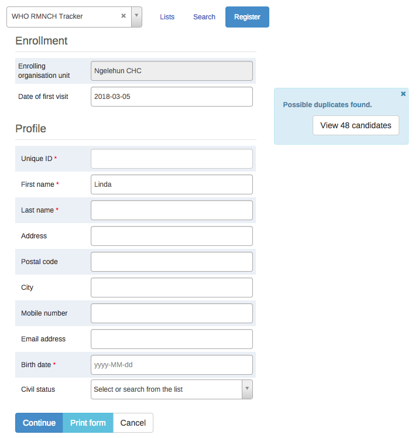

- **Save and continue**: completes the registration and opens the registered TEI's dashboard.
- **Save and add new**: completes the registration but stays on the same page. Useful to register multiple TEIs consecutively.

> Note: All mandatory attributes must be filled to save. Mandatory attributes are marked with a red star. Users with the **"Ignore validation of required fields in Tracker and Event Capture"** authority are exempt.

## Open an existing TEI dashboard

### Lists

Lists are used to find and display TEIs in the selected organisation unit and program:

1. Open **Tracker Capture** app.
2. In the organisation unit tree, select an organisation unit.
3. Select a program.
4. Click the "Lists" button.

If not configured, a set of predefined lists will be available:

- Any TEI with any enrollment status
- TEIs with an active enrollment of the current program
- TEIs with a completed enrollment of the current program
- TEIs with a cancelled enrollment of the current program

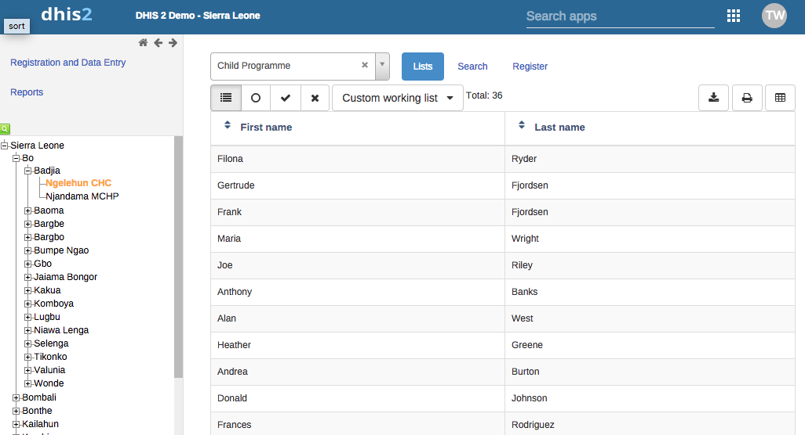

- Select columns to show/hide using the **grid** icon button.
- Create custom working lists with own filters.

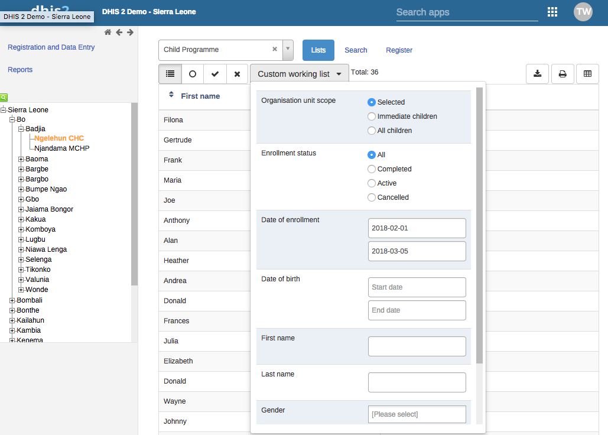

- Lists can be downloaded or printed.

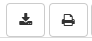

#### Custom predefined lists

Custom tracked entity filters override predefined lists.

### Search

Search is used to find TEIs across organisation units:

- **Without program context:** Unique attributes individually searchable; non-unique attributes can be combined.
- **With program context:** Configured per program. Searchable fields are grouped.

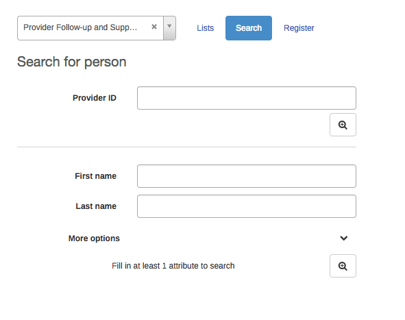

Search results:

- Unique attribute search:
  - No match → open registration form.
  - Match in selected org unit → dashboard opens.
  - Match outside selected org unit → option to open TEI.
- Non-unique attributes:
  - No match → open registration form.
  - Matches → click TEI or open registration form.
  - Too many matches → refine search.

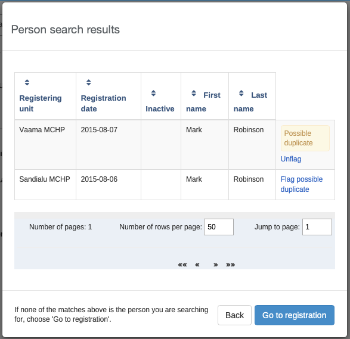

#### Flagging potential duplicates

Click **flag possible duplicate** in the search results to mark TEIs as duplicates.

  
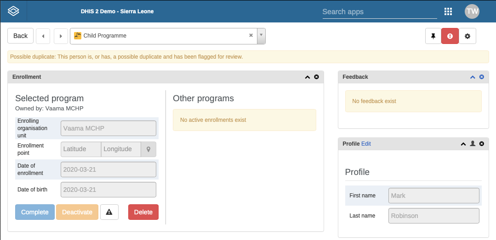

#### Breaking the glass

Users can temporarily access TEIs from units without data capture authority by providing a reason.

## Enroll an existing TEI in a program

1. Open **Tracker Capture** app.
2. Open TEI dashboard.
3. Select a program.
4. In **Enrollment** widget, click **Add new**.
5. Fill in required info and click **Enroll**.

## Enter event data for a TEI

### Widgets for data entry

| Widget name | Description |
|---|---|
| **Timeline Data entry** | Data entry using default/custom forms; events displayed chronologically. Add notes, skip-logic, validation messages supported. Compare with previous entries. |
| **Tabular data entry** | Tabular-style data entry. Lists program stages; allows inline edits for repeatable events. |

### Creating an event

1. Open TEI dashboard.
2. In **Timeline** or **Tabular** widget, click **+**.
3. Select **Program stage** and **Report date**.
4. Click **Save**.

### Schedule an event

1. Click **Calendar** icon.
2. Select **Program stage** and **Schedule date**.
3. Click **Save**.

### Refer an event

1. Click **Arrow** icon.
2. Select **Program stage**, **Organisation unit**, **Report date**.
3. Choose **One-time referral** or **Move permanently**.

### Mandatory data elements

Red-starred elements must be filled unless user has **"Ignore validation of required fields"** authority.

## How to use geometry

Capture **Point** or **Polygon** for TEI, program, or event:

- **Coordinate:** enter latitude/longitude or click map → right-click → **Set coordinate** → **Capture**.
- **Polygon:** click map → polygon icon → draw → connect last to first point → **Capture**.
- **Delete polygon:** map → trash icon → **Clear all**.

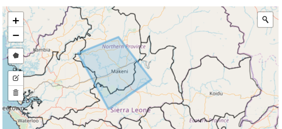

## Assign a user to an event

1. Click **Assigned user**.
2. Scroll/search → select user.

## Manage a TEI's enrollments

### TEI ownership

- Ownership starts with the organisation unit that enrolled the TEI.
- Can vary across programs.
- Update ownership via **Move permanently** in referral.

### Deactivate/Activate/Complete/Reopen enrollment

1. Open TEI dashboard.
2. In **Enrollment** widget, click **Deactivate/Activate/Complete/Reopen**.
3. Confirm **Yes**.

### Display enrollment history

- **Profile** widget → **Audit history** icon.

### Create enrollment note

- **Notes** widget → type note → **Add**.

## Send a message to a TEI

1. **Messaging** widget → select **SMS**/**E-mail**.
2. Fill contact info (auto-filled if present in profile).
3. Type message → **Send**.

## Mark a TEI for follow-up

- **Enrollment** widget → **Mark for follow-up** icon.

## Edit a TEI's profile

- **Profile** widget → **Edit** → modify → **Save**.

## Add a relationship to a TEI

- **Relationships** widget → **Add** → select relationship type → search/select relative → **Save**.  
- Bi-directional relationships appear on both TEIs.

## Share a TEI dashboard

- Copy TEI dashboard URL (contains "tei", "program", "ou").

## Deactivate/Activate/Delete a TEI

- Use top-right icon → **Deactivate/Activate/Delete** → confirm **Yes**.  
- Deleting removes all associated data.

## Configure the TEI dashboard

### Show/hide widgets

- **Settings** → **Show/hide widgets** → select → **Close**.

### Save dashboard layout as default

- **Settings** → **Save dashboard layout as default**.

### Lock dashboard layout

- **Settings** → **Lock layout for all users**.

### Top bar

- **Settings** → **Top bar settings** → **Activate top bar** → select data.

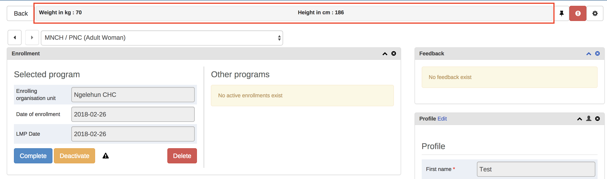

### Change table display mode for Timeline Data Entry

- Options: Default form, Compare form previous, Compare form all, Grid form, POP-over form.

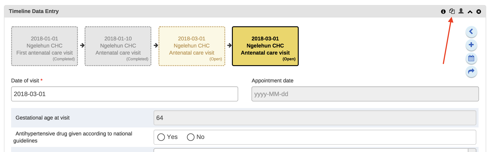

> Notes: Compare form works best with multiple repeatable events. Grid and POP-over forms not selectable if >10 data elements.

## Create reports

1. **Reports** → select report type.

| Report type | Description |
|---|---|
| Program summary | List of TEIs and records organized by program stage. |
| Program statistics | Overview of drop-outs or completion rates. |
| Upcoming events | Tabular report of upcoming events; sortable, searchable, exportable. |
| Overdue events | Tabular report of overdue events; sortable, searchable, exportable. |

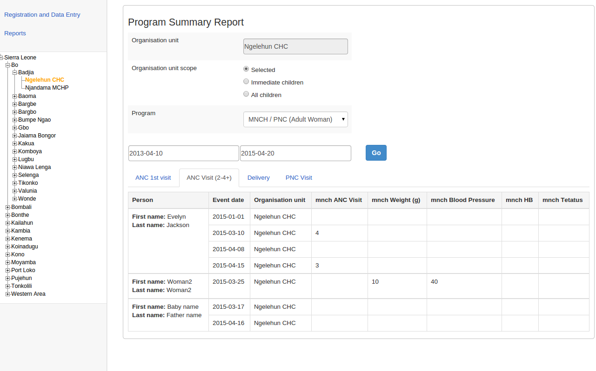
