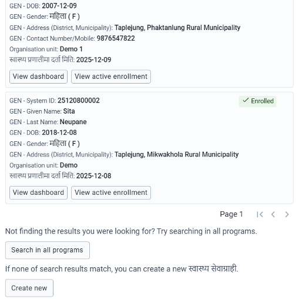

# Actions

## क)	Complete
यस कार्यक्रममा दूर्इ किसिमको Complete Action हुन्छ । Enrollment Complete र Event Complete. Event Complete option नयाँ Event Create गरे पछी वायाँ पट्टी आएको हुन्छ भने पुरानो Event लार्इ Edit गर्दा अन्तिम Option को रूपमा ठिक लगाउने गरी Complete Event Option आउँछ । Event Complete भन्नाले सेवाग्राहीको आज वा यो पटक दिनु पर्ने सेवा पुरा भएको भन्ने वुझिन्छ ।
Enrollment Complete भन्नाले अव यो सेवा मा सेवाग्राही नआउने भन्न वुझिन्छ । Basic health service मा सेवाग्राही जीवित रहे सम्म कुनै न कुनै सेवा लिन आउन सक्ने हुनाले हामी सेवाग्राही जिवित रहे सम्म Enrollment Complete गरिंदैन । तर स्वयंसेविका कार्यक्रममा स्वयंसेविका सेवावाट अवकास लिए पछि Enrollent Complete गर्न सकिन्छ । Enrollment Complete गर्न Enrollment Widget मा Enrollment Action भित्र Complete Option मा क्लिक गर्नु पर्दछ । 

## ख)	Active
यदि कुनै सेवाग्राहीको यो पटक वा यो दिनको सेवा पुरा भएको छैन भने त्यस्तो अवस्थालार्इ Incomplete वा Active event भनिन्छ । जस्तै सुत्करी सेवाको लागि भर्ना भएको सेवाग्राहीको केही कुरा अहिले भरेर वाँकि कुरा पछि भर्नका लागि New event Create गर्ने र केही कुरा भरेर Save without complete गर्ने । पछि डिस्चाको समयमा फेरी Edit Event मा गर्इ पुन वाँकि विवरण भरेर Complete गर्न सकिन्छ । Active वा Incomplete भन्नाले यो दिन वा पटकको सेवा भर्न वा दिन वाँकि भन्ने वुझिन्छ । Event जुन अवस्थामा भए पनि प्रतिवेदन निकाल्दा उक्त सेवाग्राही गणना गर्ने गरिन्छ । 
## ग)	Schedule Event 
फलो अपमा वोलाउनु पर्ने वा निश्चित समयको अन्तर वा उमेरमा सेवा लिन आउनु पर्ने भएमा अर्को भेटको लागि Schedule Event गरिन्छ । Schedule Event गर्दा कुन मितिमा कुन सेवाको लागि हो छनोट गर्नु पर्दछ । Schedule event गर्नका लागि Quick Action वाट पनि Stage छनोट गरि जान सकिन्छ भने Stage भित्र गर्इ Event को दायाँ पट्टी Tab वाट Event Schedule गर्दा Stage छनोट गर्नु पर्दैन, मिति मात्र छनोट गरे पुग्छ । 
Schedule गरेको Event मा Scheduled, Overdue र Skipped गरी ३ किसिमको अवस्था हुन सक्छ तर यदि Schedule गरेको भेट वा Event पुरा भएमा Complete गरिन्छ । Scheduled भन्नाले आगमी दिनका लागि तय गरिएका भेटहरू भन्ने वुझिन्छ भने Overdue भन्नाले भेट तय वा योजना गरिएको तर सेवाग्राही आज सम्म सेवा लिन नआएको भन्ने वुझिन्छ । त्यसै गरि Skipped भन्नाले तय गरेको भेटमा सेवाग्राही नआएको र अव सेवाग्राही सेवाका लागि नआउने भन्ने वुझिन्छ । Overdue envent मा सेवाग्राही ढिला भए पनि सेवा लिन आउन सक्छ तर Skipped मा आउँदैन । यी सवै प्रकारका सेवाग्राहीको List निकाल्न Working List को More filter मा गएर, Program Stage छनोट गरे पछि Event Status मा Filter गरी निकाल्न सकिन्छ । 

## घ)	Assign Event: 
कुनै एक स्वास्थ्य संस्था भित्र रहेका स्वास्थ्यकर्मीहरूले एक अर्कामा सेवाग्राहीहरू पठाउन Assign Event को प्रयोग गरिन्छ । जस्तै मुल दर्ता गरि सके पछि सेवाग्राही कुन स्वास्थ्यकर्मी कहाँ जाने हो सो, निज स्वास्थ्यकर्मीको User name वाट खोजी सेवाग्राही पठाउन सकिन्छ । त्यसै गरी स्वास्थ्यकर्मीले आफूलार्इ तोकिएका सेवाग्राहीहरूको विवरण Working list मा Assigned to भित्र me मा क्लिक गरि List निकाल्न सक्छन् । 

## ङ)	Search 
प्राणलीमा Log in गरी Application खोल्ने वित्तिकै Top Bar मा Search option देख्न सकिन्छ । पहिले सेवा लिएका सेवाग्राहीहरूको खोजी गर्नका लागि Search प्रयोग गरिन्छ । Search मा Click गर्दा २ वटा Option हरू देखिन्छ । Search for सेवाग्राही in a program र Search मात्र । पहिलो Option ले Basic health Service program भित्र मात्र Search गर्न प्रयोग गरिन्छ भने, Application मा रहेका सवै कार्यक्रममा खोजी गर्न Search मात्र लेखेको Option मा क्लिक गरी खर्च गर्न सकिन्छ । हामीले सेवाग्राहीलार्इ Basic Health Service कार्यक्रममा दर्ता गर्ने भएकोले हामीले Search for a सेवाग्राही in Basic Health Service मा क्लिक गरी खोजी गर्न सकिन्छ । 
खोजी गर्दा सवै भन्दा पहिले कुनै Unique नं. वाट खोजी गर्नका लागि Field top मा देखिन्छ, तर प्राय सेवाग्राहीहरू खोजी गर्दा सेवाग्राहीको अन्य विवरण जस्तै नाम थर, फोन नं. आदि वाट गरिने हुँदा उक्त विवरणहरू प्रयोग गरी खोजी गर्न Search by Attributes मा क्लिक गरी जुन विवरणको आधारमा Search गर्ने हो सोही विवरण फिल्डमा विवरण राखि खोजी गर्न सकिन्छ । विवरण राख्न पुरा विवरण नराखि खोज्दा सेवाग्राही खोज्न सजिलो हुन सक्छ । जस्तै Ranjita Gharti Magar सेवाग्राहीको नाम छ भने नाम फिल्डमा Ranjita पुरा नलेखी Jita मात्र वा Ran मा लेखि खोजी गर्दा भेट्न सजिलो हुन सक्छ किनकी पहिल नाम लेख्दा Rangeeta वा Ranjita वा Rangita वा Rangeeta आदि लेखिएको हुन सक्छ । त्यसैले पहिले जसरी लेखिएको भएता पनि समेटिने किसिमले Search word राख्दा खोजी सजिलो हुन्छ । तर Ranjita लार्इ खोजी गर्दा Ra मात्र लेखेर खोजी गरियो भने Ram, Rita, Rima, Rahul आदै सवै नामहरू आउने हुँदा सही word छनोट गर्नु महत्वपूर्ण हुन्छ । 

खोजी गरीसके पछि खोज अनुसार मिल्न गएका स्वास्थ्य संस्थामा Enroll भएका सेवाग्राहीहरूको नामावली चित्रमा दिए अनुसार प्राप्त हुन्छ । यदि खोजेको सेवाग्राही भेटिएमा उक्त सेवाग्राही लार्इ View dashboard मा क्लिक गरि सेवा निरन्तर गर्न सकिन्छ । हाम्रो एक मात्र Basic Health Service कार्यक्रम भएको हुँदा View active enrollment गरेर पनि सेवा निरन्तर गर्न सकिन्छ । यस खोजी गर्दा सेवाग्राही नभेटिएमा Search results को अन्त्यमा रहेको Create new मा क्लिक गरी नयाँ सेवाग्राही दर्ता गर्न सकिन्छ जुन Top Bar मा रहेको Create new सेवाग्राहीवाट पनि गर्न सकिन्छ । त्यसै गरी पहिले सेवा लिएको निश्चित भएमा Search Criteria परिवर्तन गरी पुन Search गर्न सकिन्छ । 
