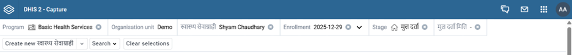
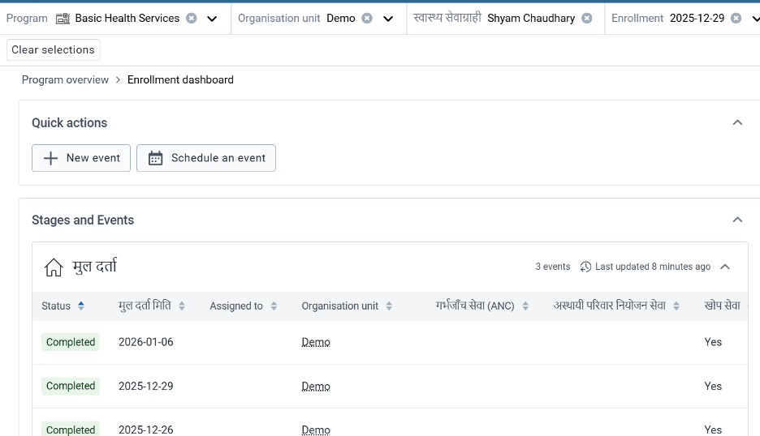
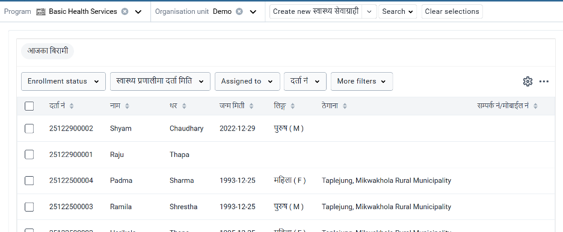

#	App भागहरू 

## Top bar

App खोले पछि Top को रंगिन रिवन भाग भन्दा ठिक तल Computer को Screen को माथिल्लो भागमा चित्रमा देखिए जस्तो देखिने भागलार्इ Top bar वा Context Selector पनि भनिन्छ । यस भागमा कार्यक्रम (Program), स्वास्थ्य संस्था (Organization unit), Tracked Entity को नाम (सेवाग्राहीको नाम), Enrollment मिति, Program Stage, Create new Tracked Entity (स्वास्थ्य सेवाग्राही), Search र Clear Selections भन्ने Tab हरू रहेको हुन्छ र सेवा प्रदायकले त्यहाँ वाट विवरणहरू परिवर्तन गर्न सक्छन् । 

## Enrollment Dashboard 

Program र Organization Unit छनोट गरे पछि आउने चित्रमा देखिए जस्तो भागलार्इ Enrollment Dashboard भनिन्छ । यसमा विभिन्न खण्डहरू रहेका हुन्छन् । सवै भन्दा माथि Quick Action Button देख्न सकिन्छ जस अन्तरगत New Event र Schedule an event रहेका छन् । छनोट गरिएको सेवाग्राहीलार्इ यसै खण्डको New Event मा गर्इ सेवाको प्रकार छनोट गरि सेवा विवरण भर्न सकिन्छ भने Schedule an event वाट फलोअप सेवा वा अर्को पटकको सेवा कहिले लिन वोलाउने हो सो विवरण यसै खण्डवाट पनि भर्न सकिन्छ । 

Quick Action भन्दा तल Stages and events खण्ड रहेको हुन्छ जसमा सेवाग्राहीले आज भन्दा पहिले लिएका सेवाहरू Stage अनुसार रहेको देख्न सकिन्छ । ध्यान दिन पर्ने कुरा के हो भने यस खण्डमा एक पटक वा दिनको सेवाको एक लार्इन रहेको हुन्छ । जस्तै माथिको चित्रमा मुल दर्ता भन्ने सेवामा सेवाग्राही ३ पटक सेवा लिन आएको देखिन्छ । ती लाइनको कुनै पनि स्थानमा क्लिक गरेर त्यस दिनको सेवाहरूको विवरण हेर्न सकिन्छ । यसरी सेवाग्राहीले पहिले कुन Program Stage मा कति पटक सेवा लिएको छ यसै खण्डमा देखिने गर्दछ । ती सवै सेवाहरू (Events) लार्इ Top मा देखिएको प्रत्येक विवरणको पछि देखिने तल र माथि को संकेत मा क्लिक गरि Sort गर्न सकिन्छ । त्यस्तै एकै Stage मा ५ भन्दा वढि Event हरू भएमा Shore more मा क्लिक गरि हेर्न सकिन्छ । 

## Widgets 
Computer को दायाँ पट्टी रहेका खण्डहरूलार्इ Widgets हरू भनिन्छ जसमा विभिन्न किसिमका Widgets हरू रहेका हुन्छन् । 
- १)	Indicators Widgets 
सेवाग्राहीको अन्तिम पटकको सेवा वा हालको सेवा सम्वन्धि महत्वपूर्ण विवरणहरू Indicators Widgets मा राखिएको हुन्छ, जस्तै सेवाग्राहीको हालको उमेर, सेवा दर्ता नं. आदि 
- २)	सेवाग्राही (Tracked Entity Profile) 
यस खण्डमा Tracked Entity Attributes हरू उल्लेख गरिएको हुन्छ र यसै खण्डको Edit गर्इ सेवाग्राहीको विवरण अध्यावधिक गर्न वा तीनवटा डट भित्र गर्इ हाल सम्म कुन कुन User ले के के गरिवर्तन गरेको छ हेर्न सकिन्छ । 
- ३)	Enrollment Widget 
यस खण्डमा सेवाग्राही कहिले दर्ता भएको हो, कुन संस्थामा दर्ता भएको हो र हाल कुन संस्थामा रहेको छ भन्ने विवरण राखिएको हुन्छ । यसै खण्डमा Enrollment Action भित्र Complete, Mark for follow up र Transfer Option हरू पनि रहेका हुन्छन् । 
- ४)	Note about this enrollment
Enrollment को क्रममा वा पछि पनि Enrollment संग सम्वन्धित केहि विवरण सेवा प्रदायकले लेख्न वा टिपोट गर्न चाहेमा Enrollment Note लेख्न सकिन्छ । जस्तै कुनै सेवाग्राहीको अपागता सम्वन्धी विवरण वा अन्य कुनै विवरण । 
- ५)	सेवाग्राही Relationships 
यस खण्डवाट सेवाग्राहीको विचमा Relationship लिंक गर्न सकिन्छ । जस्तै आमा र वच्चा, Index case and Secondary case, दाजु भाइ दिदि वहिनी, एकै परिवारका सदस्य आदि उपलव्ध भए अनुसार । 

## Working list

माथिको चित्रमा देखाए जस्तै कार्यक्रम छनोट गरेको तर सेवाग्राही छनोट नगरेको अवस्थामा screen मा देखिने सेवाग्राहीको List लार्इ Working List भनिन्छ । स्वास्थ्य सेवा प्रदायकहरूको लागि यो List एक दमै महत्वपूर्ण हुन्छ । यसमा माथिल्लो वारमा Enrollment Status, Enrollment मिति (स्वास्थ्य प्रणालिमा दर्ता मिति), Assigned to र More filters option हरू देखिएको छ भने कुना पट्टी दायाँ भागमा Setting जस्तै Option र तिन वटा डट हरू दिर्इएको छ । हामीले Enrollment Status वाट वा दर्ता मिति वाट र Assigned to me वाट यहाँ सेवाग्राही Filter गर्न सकिन्छ भने अन्य विवरण वाट Filter गर्नु परेमा More filter मा रहेको विवरणमा Click गरी Filter गर्न सकिन्छ । यो List मा के के कुरा देखाउने, के नदेखाउने भन्ने कुरा Setting वटनमा क्लिक गरेर छनोट गर्न वा हटाउन सकिन्छ भने Dynamic Working list बनार्इ Save गर्न सकिन्छ जुन माथिको चित्रमा जस्तै आजका विरामी वा पिल्सका सेवाग्राही वा वि.सि.जि. लगाएका वच्चा वा यस्तै List वनार्इ Save गर्न सकिन्छ र आवश्यकता अनुसार परिमार्जन पनि गर्न सकिन्छ । 
More Filter भित्र अन्तमा Program Stage Option वाट Program Stage अनुसार Selection गरि सेवाग्राहीहरूको लिष्ट निकाल्न सकिन्छ । जस्तै उच्च रक्तचाप भएका विरामीको List चाहिएमा Program Stage वाट OPD/NCD सेवा र ICD वाट Hypertension भएका विरामी Filter गरी List निकाल्न सकिन्छ र उक्त List लार्इ तीन वटा डटमा क्लिक गरि Save गर्न र पछि सजिलो गरी हेर्न सकिन्छ । 

