#	मुल दर्ता भर्ने तरिका

डिजिटल प्रणालीमा सेवाग्राहीलार्इ जीवनकालमा एक पटक मात्र प्रणालीमा दर्ता गर्न सकिन्छ । यदि सेवाग्राहीको विवरण पछि परिवर्तन भएमा सेवाग्राही Profile Widget मा गर्इ परिवर्तन गर्न सकिन्छ । जस्तै BCG खोपको लागि शिशु दर्ता गर्दा नाम नराखिएको हुन सक्छ वा Baby of parents गरी दर्ता गरेको हुन सक्छ । तर उक्त शिशुको नाम राखिसकेपछि पुन Enrollment नगरी पहिलेकै Enrollment मा नाम सच्याउनु पर्दछ । यस प्रणालीमा नयाँ सेवाग्राही भन्नाले जीवनकालमा कहिले पनि सेवा नलिएको वा प्रणालीमा दर्ता नभएको सेवाग्राही भन्ने वुझ्नु पर्दछ । पुरानो सेवाग्राही भन्नाले पहिले कुनै समयमा दर्ता भएको सेवाग्राही भन्ने वुझ्नु पर्दछ । मुल दर्ता फारम भर्दा सेवाग्राही चालु आ.व. को श्रावण पछि सेवा लिएको भए मुल दर्ता प्रकारमा पुरानो र चालु आ.व. मा पहिले सेवा नलिएको भए नयाँमा क्लिक गर्नु पर्दछ । मुल दर्ताका लागि तल चित्रमा दिए जसरी नयाँ र पुराना सेवाग्राहीहरू लार्इ मुल दर्ता गर्नु पर्दछ । 

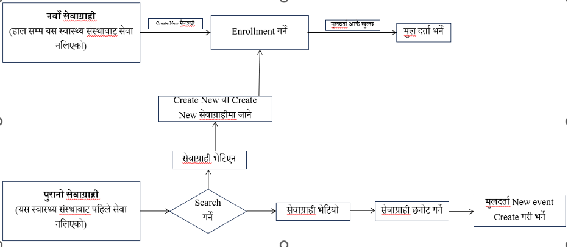

## मुल दर्ता फारम भर्ने तरिका
मुल दर्ता विवरण नयाँ सेवाग्राहीको लागि Enrollment Save गर्दा आफु खुल्छ भने पुराना सेवाग्राहीको लागि मुल दर्ता Stage को ठिक तल Create new वाट वा Quick action वाट मुल दर्ता Click गरी नयाँ मुल दर्ता विवरण खोल्न सकिन्छ । विवरण खोल्दा तल चित्रमा दिए जस्तैमात्र फारम खुल्छ जसमा सेवाहरूको विवरण देखिँदैन । हामीले मुल दर्ता मितिमा मिति छनोट गरे पछि मात्र कुन कुन सेवाहरू उक्त सेवाग्राहीका लागि उपयुक्त हुन्छ सो सेवाहरू छनोटको लागि देखिन्छ । यस प्रणालीमा निम्न अनुसार सेवाहरू देखिने गरि बनार्इएको छ । ध्यान दिनु पर्ने कुरा मासिक प्रतिवेदनमा सेवाग्राहीको उमेर अनुसार संख्या निकाल्दा यसै मूल दर्ताको आधारमा निकालिने भएकोले पुराना सेवाग्राहीलार्इ जुनसुकै सेवा दिंदा पनि पहिले मूलदर्ता गरेर मात्र दिनु पर्दछ अन्यथा सेवाग्राहीको संख्या फरक पर्न सक्छ । 

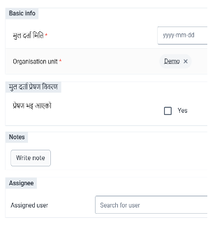

| समूह | देखिने सेवाहरू | नदेखिने सेवाहरू |
|------|---------------|----------------|
| ५ वर्ष वा कम | खोप, पोषण, IMNCI, IMAM, TB, Malaria, Leprosy, Kala-azar, Death, AEFI, Laboratory | प.नि., ANC, Delivery, PNC, Neonatal care, OPD/NCD, Safe abortion, Emergency contraception, RH morbidity |
| ५ वर्ष माथिका पुरूष | OPD, स्थायी परिवार नियोजन, TB, Malaria, Leprosy, Kala-azar, Death, Laboratory | ANC, Delivery, Neonatal care, PNC, IMNCI, Nutrition, Immunization, IMAM, Safe abortion, RH morbidity, AEFI |
| ५ देखि १३ वर्ष महिला | OPD, खोप, पोषण, AEFI, TB, Leprosy, Malaria, Kala-azar, Laboratory, Death | IMAM, RH morbidity, IMNCI, ANC, Delivery, PNC, Neonatal Care, Family planning |
| १४ देखि १८ महिला | OPD, खोप, पोषण, AEFI, ANC, Delivery, PNC, Neonatal care, Safe abortion, Family planning, TB, Leprosy, Malaria, Kala-azar, Death, Laboratory | IMNCI, IMAM, RH morbidity |
| १९ देखि ४९ महिला | OPD, ANC, Delivery, PNC, Neonatal care, Safe abortion, Family planning, TB, Leprosy, Malaria, Kala-azar, Death, Laboratory, RH morbidity | Nutrition, Immunization, AEFI, IMAM |
| ५० माथि महिला | OPD, RH morbidity, TB, Leprosy, Malaria, Kala-azar, Death, Laboratory | Immunization, Nutrition, AEFI, IMAM, IMNCI, ANC, Delivery, PNC, Neonatal care, Family planning, Emergency contraception, Safe abortion |

तर, यदि सेवाग्राहीलार्इ पहिले हालको उमेर अनुसार उपयुक्त नदेखिने सेवाहरू दिर्इएको विवरण सम्वन्धित Stage मा देखिन्छ । जस्तै ७ वर्षको पुरूषलार्इ मूल दर्ता फारम भर्दा खोप सेवा देखिँदैन तर उक्त व्यक्तिले २ वर्षको हुँदा खोप सेवा लिएको विवरण Stage भित्र देखिन्छ । मूल दर्ता नगरी सेवा दिएको अवस्थामा चित्रमा देखाए जस्तै Validation Warning आउन सक्छ, जुन समयमा Save anyway गरि दिर्इएको सेवा Save गर्ने र मुल दर्ता विवरण भर्नु पर्दछ । 

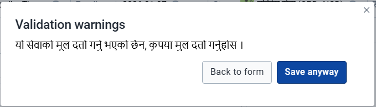

मूल दर्ता विवरणमा उपलव्ध गराउने सेवाहरूमा ठिक चिन्ह लगाए पश्चात यदि थप विवरण केही भए Write Note गर्इ Note लेख्न सकिन्छ । यदि स्वास्थ्य संस्थामा दर्ता गर्ने एक स्थान र सेवा दिने अर्को स्थान वा व्यक्ति भए मुल दर्ता गर्ने व्यक्तिले Assignee खण्डमा Assigned user मा आफ्नो स्वास्थ्य संस्थाको कुन व्यक्तिलार्इ सेवाग्राही पठाउने हो उसको User Name वाट खोजी गरी पठाउन सकिन्छ । यसरी विवरण भरिसके पछि Complete Option मा Click गर्ने र मूल दर्ता प्रकृया पुरा हुन्छ । 
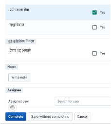

आफूलार्इ तोकिएका (Assign गरीएका) सेवाग्राही खोज्ने तरिका
रेर्कडिङ App खोले पछि प्राय तलको Window देखिन्छ । तर Program छनोट नभएको हुन सक्छ । program र Organization unit छनोट गरि सके पछि स्वास्थ्य संस्थामा हाल सम्मका सेवाग्राहीहरूको List निकाल्न या त दायाँ पट्टि भएको Create Saved list मा क्लिक गर्नु पर्दछ । 

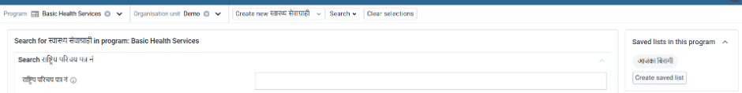

Program छनोट गरे पछि See all records accessible to you in Basic Health Services भन्ने Option मा क्लिक गरेर 

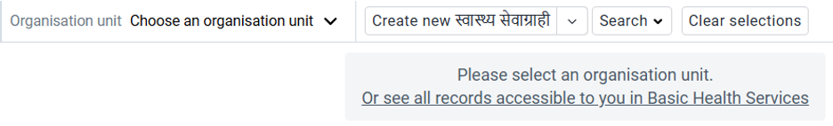

सेवाग्राहरूहरू List निकाल्न सकिन्छ , जुन तल दिएको चित्रमा देखिए अनुसारको लिस्ट देखिन्छ जसलार्इ Working list भनिन्छ । 

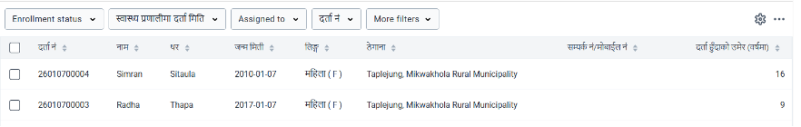
 
यो List को माथि Assigned to मा क्लिक गरी Me मा क्लिक गर्दा आफूलार्इ तोकिएका सेवाग्राहीहरूको List आउँछ । र Assigned to : Me भन्ने Option Highlight हुन्छ । यो कार्य संधै गर्नु भन्दा आफूलार्इ आज तोकिएका विरामीको List Save गरेर राख्दा 
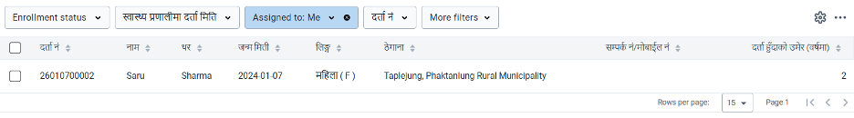
संधैलार्इ सजिलो हुन्छ । त्यसको लागि More filters मा गर्इ Program Stage मा जानुहोस । त्यस पछि Stage filters खण्डमा Program Stage मा मुल दर्ता छनोट गर्नुहोस र Update क्लिक गर्नुहोस । अव Stage Filter कै खण्डमा Assigned to भन्ने Field देखिन्छ, त्यहाँ क्लिक गरी Me मा छनोट गर्नुहोस र Update गर्नुहोस । Stage Filter खण्डमै मुल दर्ता मिति मा क्लिक गरी Today मा क्लिक गर्नुहोस र Update गर्नुहोस । 
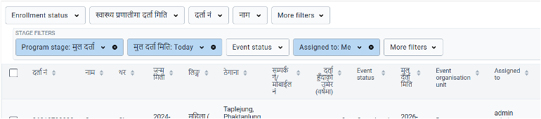
अव तपाइको Window निम्नानुसारको देखिने छ । यहाँ तपार्इलार्इ तोकिएका विरामीहरूको List देखिन्छ । तर वारम्वार यहि प्रकृया गर्न भन्दा यो Window लार्इ Save गरी एकै क्लिकमा आज मलार्इ तोकिएका विरामीको List निकाल्न सकिन्छ । त्यसको लागि दायाँ पट्टी तिन वटा डटमा क्लिक गर्नुहोस र Save Current View मा क्लिक गर्नुहोस । त्यस पछि त्यहाँ चाहे अनुसारको नाम दिनुहोस । उदाहरणका लागी यहाँ Me today नाम दिर्इको छ । त्यस पछि Save मा क्लिक गर्नुहोस ।अव तपार्इको Working List को माथि Me today भन्ने Tab देखिन्छ । तपार्इले त्यसमा क्लिक गरी संधै आफूलार्इ तोकिएका सेवाग्राहरूको List हेर्न सक्नुहुन्छ । यो List हरेक दिन सेवाग्राही तोकिए अनुसार आफै Update हुन्छ र App खोलेर Program छनोट गरेपछि Me today tab Screen को दायाँ पट्टी Save List in this program मा समेत देख्न र त्यही वाट List निकाल्न सकिन्छ । 
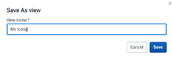
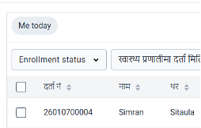