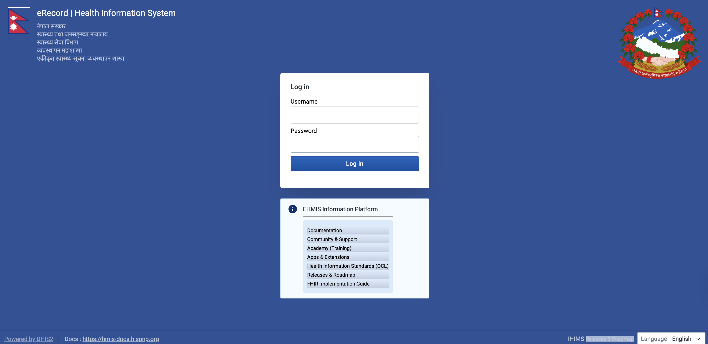

# DHIS2 Login User Manual

## 1. Introduction

This user manual provides step-by-step guidance on how to log in to the **DHIS2 (District Health Information Software 2)** system. It is intended for DHIS2 users such as data entry operators, health workers, supervisors, and administrators.

---

## 2. System Requirements

Before logging in, ensure the following:

* A computer, tablet, or smartphone
* Stable internet connection
* A supported web browser:

  * Google Chrome (recommended)
  * Mozilla Firefox
  * Microsoft Edge
  * Safari
* Valid DHIS2 **username** and **password**

---

## 3. Accessing the DHIS2 System

1. Open your preferred web browser.
2. Enter the DHIS2 system URL in the address bar (for example):

   ```
   https://erecord.hmis.gov.np
   ```
3. Press **Enter**.
4. The DHIS2 login page will appear.

---

## 4. DHIS2 Login Screen Overview



The DHIS2 login screen typically contains:

* **Username field** – Enter your assigned username
* **Password field** – Enter your password
* **Log in button** – Click to access the system
* **Language selector** (if enabled)

---

## 5. How to Log In

Follow these steps to log in:

1. Click on the **Username** field and type your username.
2. Click on the **Password** field and type your password.

   * Passwords are case-sensitive.
3. Click the **Log in** button.
4. If the credentials are correct, the DHIS2 dashboard will load.

---

## 6. First-Time Login

If you are logging in for the first time:

* You may be prompted to **change your password**.
* Choose a strong password that:

  * Has at least 8 characters
  * Includes uppercase and lowercase letters
  * Includes numbers and special characters
* Save the new password securely.

---

## 7. Forgot Password

If you forget your password:

1. Click on **Forgot password?** (if enabled).
2. Enter your registered username or email address.
3. Follow the instructions sent to your email.

> If password recovery is not enabled, contact your **DHIS2 system administrator**.

---

## 8. Common Login Errors and Solutions

### 8.1 Invalid Username or Password

* Ensure there are no typing errors.
* Check Caps Lock is off.
* Verify your credentials with the system administrator.

### 8.2 Account Disabled

* Your account may be deactivated due to inactivity or security reasons.
* Contact the system administrator to reactivate it.

### 8.3 Page Not Loading

* Check your internet connection.
* Try refreshing the page.
* Clear browser cache or try a different browser.

---

## 9. Security Best Practices

* Do not share your username or password.
* Always **log out** after using DHIS2, especially on shared devices.
* Change your password regularly.
* Avoid saving passwords in public browsers.

---

## 10. Logging Out of DHIS2

1. Click on your **profile icon** (top-right corner).
2. Select **Log out**.
3. Close the browser window.

---

## 11. Support and Help

For login issues or access requests:

* Contact your **DHIS2 System Administrator**
* Provide the following details:

  * Username
  * Organization Unit
  * Description of the issue

---

## 12. Document Information

* **Document Title:** DHIS2 Login User Manual
* **Version:** 1.0
* **Last Updated:** 2026

---

*End of Document*
