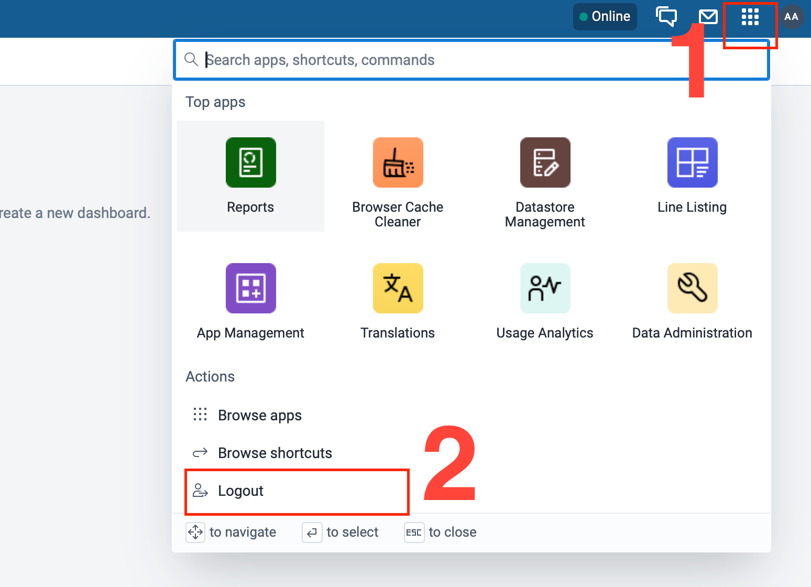

# DHIS2 Logout User Manual

## 1. Introduction

This user manual explains how to **safely log out of the DHIS2 (District Health Information Software 2)** system. Proper logout is important to protect data security, especially when using shared or public devices.

---

## 2. Why Logging Out Is Important

Logging out of DHIS2 helps to:

* Prevent unauthorized access to health data
* Protect your user account and permissions
* Ensure data confidentiality and system security
* Avoid accidental data entry under the wrong user account

---

## 3. When to Log Out

You should always log out:

* After completing your work in DHIS2
* Before closing the browser
* When using a shared or public computer
* Before leaving your workstation

---

## 4. How to Log Out of DHIS2

Follow these steps to log out safely:

1. Ensure all your work is **saved**.
2. Look at the **top-right corner** of the DHIS2 screen.
3. Click on your **profile icon** (user avatar or username).
4. A dropdown menu will appear.
5. Click **Log out**.
6. You will be redirected to the DHIS2 login page.

---

## 5. Logging Out on Shared Devices

If you are using a shared device:

* Always confirm you are redirected to the login page
* Close the browser completely after logging out
* Do not allow the browser to save your password

---

## 6. Common Logout Issues and Solutions

### 6.1 Log out Option Not Visible

* Resize the browser window
* Ensure you are logged in
* Try refreshing the page

### 6.2 Browser Closed Without Logging Out

* DHIS2 may keep the session active for some time
* Always log out manually to avoid security risks

### 6.3 Session Timeout

* DHIS2 may automatically log you out after inactivity
* Log in again to continue your work

---

## 7. Security Best Practices

* Never leave DHIS2 open when unattended
* Do not share your login session with others
* Log out even on personal devices
* Change your password regularly
